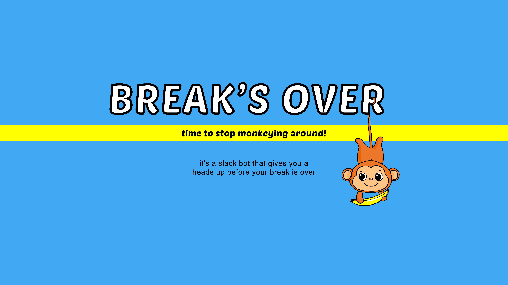

# Break's Over Slack Bot 



## 
public/images/monkeytitle.jpg

Break's Over Bot is a Slack Bot made alert students when break time is over.  Students often don't know when the break time was started.  While devouring lunch, time might slip on by...  Break's Over Bot will alert students so they will never be late again.

### What's Used
* [Botkit core](https://botkit.ai/docs/core.html) - a complete programming system for building conversational software
* [Pre-configured Express.js webserver](https://expressjs.com/) including:
   * A customizable "Install my Bot" homepage
   * Login and oauth endpoints that allow teams to install your bot
   * Webhook endpoints for communicating with platforms
* Sequelize npm
* Jaws-db database


### Getting Started

Break's Over is Open Source so if you ever want to add to or test the bot feel free.
git clone 

#### Install Break's Over
```
npm install
```

Clone this repository using Git:

`git clone https://github.com/annasylvester/breaksover-bot`

View diployed project at Heroku:
https://breaksover.herokuapp.com/

# Authors
Anna Sylvester

Aaron Lee

Sydney Robinson

Morgan Garcia

